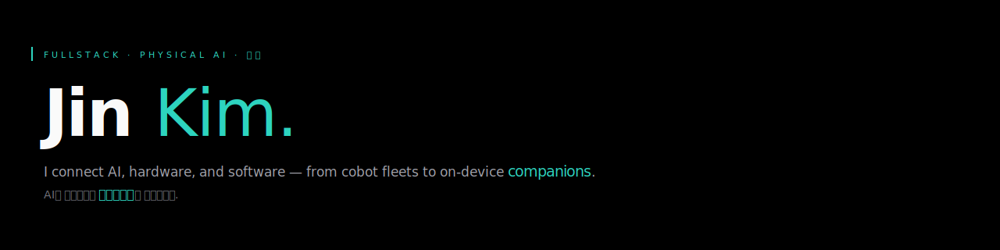

 

## ✦ &nbsp; FEATURED WORK

<table>
<tr>
<td width="50%" valign="top">

<b>Bom</b> &nbsp;OSS · on-device LLM

On-device senior care AI. Daily wellness chats via KakaoTalk, family digests, Gemma 4 E2B. <em>No cloud. No data leaving home.</em>

→ <a href="https://github.com/kimjinhyuk/allescare-bom"><b>github.com/kimjinhyuk/allescare-bom</b></a>

</td>
<td width="50%" valign="top">

<b>MRC</b> &nbsp;협동로봇 통합 플랫폼

Hardware-agnostic open AI-native cobot platform. <em>6 vendors, one API, one node editor.</em> FastAPI + React Flow + ROS2 + pybind11.

→ <a href="https://blog.jinhyuk.kim/projects/mrc/"><b>blog.jinhyuk.kim/projects/mrc</b></a>

</td>
</tr>
<tr>
<td colspan="2" valign="top">

<b>DRP — Drawing Robot Platform</b> &nbsp;AI line drawing · 9-part series

Photos transformed into line drawings by Gemini AI, drawn in real time by industrial robot arms (JAKA). Remote monitoring across field deployments. End-to-end design decisions documented in a 9-part series — <em>from raw TCP protocol to pen calibration to Flutter monorepo.</em>

→ <a href="https://blog.jinhyuk.kim/projects/drp/"><b>blog.jinhyuk.kim/projects/drp</b></a>

</td>
</tr>
</table>

 

## ✎ &nbsp; RECENT THINKING

<!-- BLOG-FEED:START -->
- [전자결재 양식 14종을 컴포넌트 14개 없이 만드는 법 — 스키마 엔진 + 플러그인](https://blog.jinhyuk.kim/projects/groupware/2026-07-20-schema-driven-approval-form-engine)  · 2026.07.20
- [프론트 자동계산을 믿지 않는 법 — 결정적 폼 계산과 서버 재검증](https://blog.jinhyuk.kim/projects/groupware/2026-07-20-deterministic-form-calculation)  · 2026.07.20
- [동적 폼 엔진 E2E가 잡아낸 것들 — 계산보다 어려웠던 상태 동기화](https://blog.jinhyuk.kim/projects/groupware/2026-07-20-form-engine-e2e-lessons)  · 2026.07.20
<!-- BLOG-FEED:END -->

→ <a href="https://blog.jinhyuk.kim"><b>blog.jinhyuk.kim</b></a> &nbsp;·&nbsp; auto-refreshed daily

 

## ⚙ &nbsp; STACK

 

## ◐ &nbsp; ACTIVITY

<table>
<tr>
<td width="62%" valign="top">

</td>
<td width="38%" valign="top">

<b>Now</b>

Shipping <b>MRC</b> — multi-vendor cobot integration with adapter pattern. Iterating <b>Bom</b> 0→1.

Reading: world models, embodied agents, the <em>seam between intent and machine</em>.

→ <a href="https://blog.jinhyuk.kim"><b>more on blog.jinhyuk.kim</b></a>

</td>
</tr>
</table>

 

---

→ <a href="https://jinhyuk.kim"><b>jinhyuk.kim</b></a>
&nbsp;·&nbsp;
→ <a href="https://blog.jinhyuk.kim"><b>blog.jinhyuk.kim</b></a>
&nbsp;·&nbsp;
→ <a href="https://www.linkedin.com/in/kimjinhyuk2/"><b>linkedin</b></a>
&nbsp;·&nbsp;
→ <a href="mailto:contact@jinhyuk.kim"><b>contact@jinhyuk.kim</b></a>

